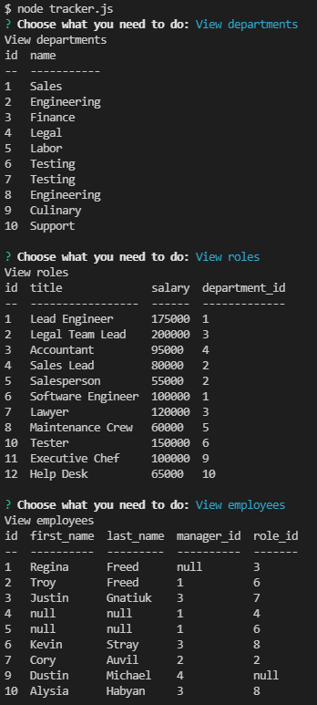

 # My Employee Management System

 This project is covered by the ISC license.

# Table of Contents
1. [Screenshots](#Screenshots) 
2. [Project Description](#description)
3. [Installation Process](#installation)
4. [Usage](#usage)
5. [Contributors](#contribution)
6. [License Coverage](#license)
7. [Questions](#questions)
    
## Screenshots:

## Description: 
This project was designed around building a CLI that employers can use to organize and keep track of all employees acrossed different departments for their business. With this application you are able to add departments, employees, and employee roles. You are also able to view all departments, roles, and employees in your business as well as updating employees role ID to change their role, if needed.

## Installation: 
To run this program you will need to install the required dependencies: MySQL package, Inquirer package, and Console.table package. Also you must have node installed on your machine to run the program as well as MySQL workbench to use the DB schema. Side note: If you want to try the application make sure your password in the code matches your database SQL password.

## Usage: 
To run this application you will need to invoke the "node tracker.js" command in the terminal.

## Contribution: 
This project is currently not open to public contributions.

## Questions: 
Any questions, comments, or concerns, please feel free to contact me at:
* Github: (https://github.com/Tfreed94)
* Email: tfreedwebdev94@gmail.com